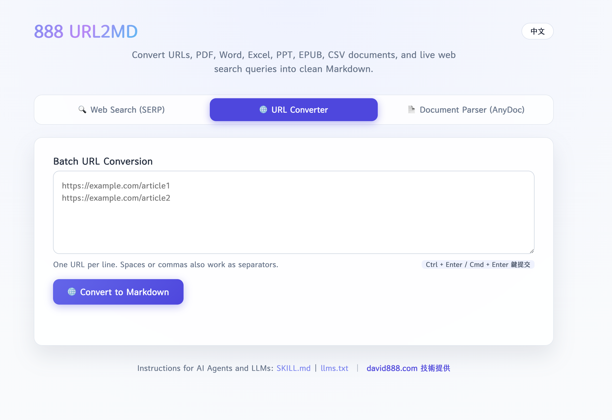
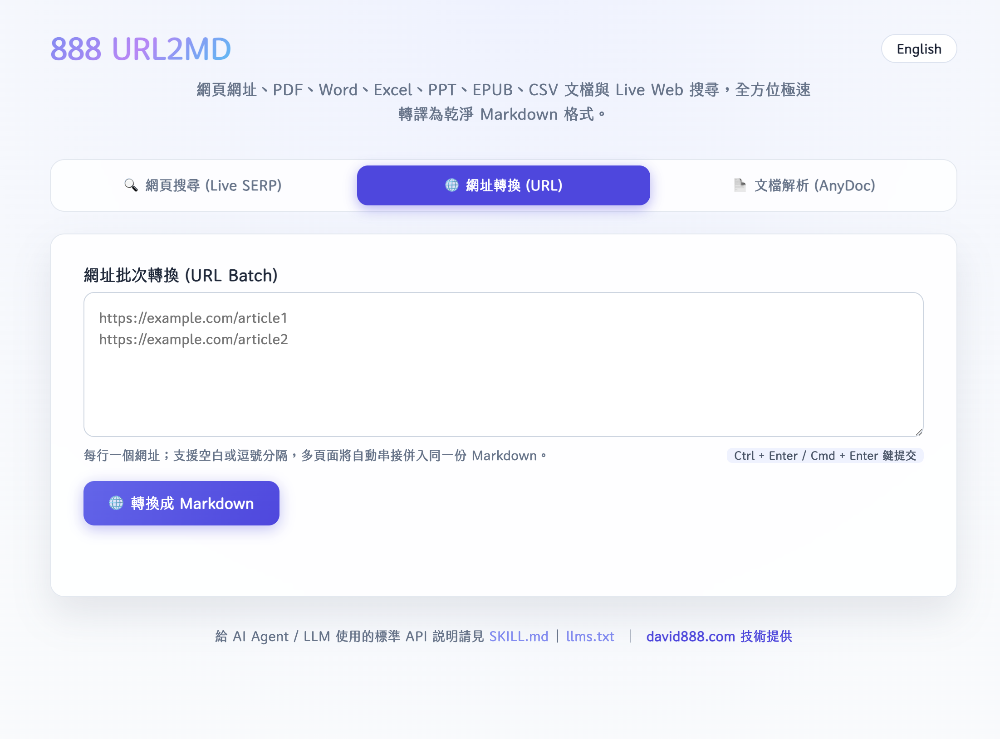

# 888 URL to Markdown (888-url2md)

> **感謝原作者 (Acknowledgement)**: 本專案基於著名的 [Jina AI Reader (`jina-ai/reader`)](https://github.com/jina-ai/reader) 開源專案進行二次開發與增強。特別感謝 Jina AI 團隊打造優秀且強大的網頁轉 Markdown 引擎！






A high-performance Web Reader, Multi-URL Batch Crawling, and Web Search API service designed specifically for LLMs, RAG pipelines, and AI Agents. Converts web pages and search queries into clean Markdown or structured JSON.

Currently deployed at: [**create360.ai**](https://create360.ai) (or easily self-hosted).

---

## 🚀 核心特性 (Features)

1. **單頁 / 多網址併發批次抓取 (Multi-URL Batch Crawling)**
  - 支援 `GET /<URL>`、`POST /v1/batch`、`POST /batch` 以及 `POST /`（傳送 `urls` 陣列）。
  - **高併發處理**：同時併行抓取多個網址，顯著降低 LLM 工具調用的往返時間 (RTT)。
  - **獨立容錯 (Fault Isolation)**：單一網址失敗（如 404 或 DNS 錯誤）不會中斷整批請求，成功頁面依舊正常返回。
2. **即時 Web 搜尋 (Real-time Web Search &amp; SERP)**
  - 支援 `GET /s/<query>` 與 `GET /search?q=<query>`。
  - 內建開箱即用的 DuckDuckGo HTML SERP，完全免金鑰即可搜尋全球網頁與繁體中文內容並即時轉為 Markdown。
3. **Agent Skill &amp; 首頁自動教學 (Interactive `SKILL.md`)**
  - 訪問首頁 `GET /`（使用 Markdown/Text）或 `GET /skill.md` 時，自動提供標準的 `**SKILL.md` 說明文件**，教導首次訪問的 LLM 如何安裝與呼叫 `888-url2md` 工具。
4. **符合 `/llms.txt` 與 `/llms-full.txt` 最新標準 (llmstxt.org)**
  - 內建 `/llms.txt` 與 `/llms-full.txt` 端點，方便 AI Agent（如 Cursor, Windsurf, LangChain, LlamaIndex, OpenAI GPTs, Claude 等）在 Inference 階段自動識別與導覽網站能力。
5. **動態 Domain 參數化 (Dynamic Domain Detection)**
  - 自動偵測環境變數 (`PUBLIC_DOMAIN`, `BASE_URL`) 或 HTTP 請求 Header (`x-forwarded-host`, `Host`)，自動將說明文件與 JSON 內的網址替換為目前部署的域名（如 `https://create360.ai` 或 `http://localhost:3000`）。
6. **Firecrawl AnyDoc 超極速多格式文檔轉譯 (High-Performance AnyDoc Parser)**
  - 整合 Firecrawl 最新開源的 Rust 文檔解析引擎 `@firecrawl/anydoc`。
  - 支援 PDF, Word (.docx/.doc), Excel (.xlsx/.xls), PowerPoint (.pptx/.ppt), EPUB, RTF, OpenDocument (ODT/ODS/ODP), CSV 等 14+ 種文檔格式。
  - 提供 **&lt; 5ms 毫秒級解析超高速度**與統一高品質 GitHub-Flavored Markdown 輸出，大幅超越傳統 LibreOffice 轉換速度。
7. **WebMCP 瀏覽器工具 (WebMCP Browser Tools)**
  - 在支援 WebMCP 的 Chrome 瀏覽器中，首頁會透過 `document.modelContext` 註冊 `search_web`、`read_web_page` 與 `read_web_pages` 唯讀工具。
  - 工具會回傳乾淨 Markdown，並同步更新首頁結果區；不支援 WebMCP 的瀏覽器維持原本表單功能。
8. **進階爬取與資料抽取 (Advanced Crawling & Extraction)**
  - 可用 CSS/XPath schema 直接抽取重複資料並回傳 `extracted` JSON。
  - 可選用 `contentFilter: "pruning"` 或 `"bm25"` 產生較精簡的 `fitMarkdown`。
  - 支援有上限的 BFS deep crawl、prefetch、session cookie 延續與 virtual scroll。
  - 長任務支援 `asyncJob`、進度查詢、取消與 HTTPS webhook。

---

## 🐳 Docker 安裝與部署 (Docker Deployment)

本專案提供多種 Docker 安裝與部署方式，可直接使用 GHCR (GitHub Container Registry) 預建映像檔或自原始碼構建：

### 1. 使用 GHCR 預建映像檔 (Quickstart via GHCR)

```bash
# 1. 從 GitHub Container Registry 拉取最新 (latest) 映像檔
docker pull ghcr.io/tbdavid2019/888-url2md:latest

# 2. 啟動容器 (對外 Port 8081，設定公開域名)
docker run -d \
  --name 888-url2md \
  -p 8081:8081 \
  --security-opt seccomp=unconfined \
  --restart always \
  -e PUBLIC_DOMAIN='https://create360.ai' \
  ghcr.io/tbdavid2019/888-url2md:latest
```

### 2. 從原始碼本地構建與運行 (Build from Source)

```bash
# 1. 複製儲存庫
git clone https://github.com/tbdavid2019/888-url2md.git
cd 888-url2md

# 2. 構建 Docker 映像檔
docker build -t 888-url2md:latest .

# 3. 啟動容器
docker run -d \
  --name 888-url2md \
  -p 8081:8081 \
  --security-opt seccomp=unconfined \
  --restart always \
  -e PUBLIC_DOMAIN='https://create360.ai' \
  888-url2md:latest
```

### 3. Docker Compose 部署指南

```yaml
version: '3.8'

services:
  888-url2md:
    image: ghcr.io/tbdavid2019/888-url2md:latest
    container_name: 888-url2md
    ports:
      - "8081:8081"
    security_opt:
      - seccomp:unconfined
    restart: always
    environment:
      - PUBLIC_DOMAIN=https://create360.ai
      - PORT=8081
```

### 4. 主要環境變數說明 (Environment Variables)

| 環境變數 | 說明 | 預設值 / 範例 |
| :--- | :--- | :--- |
| `PUBLIC_DOMAIN` | 服務對外公開主機域名（用於產出連結與 SKILL.md 自動代入） | `https://create360.ai` |
| `PORT` | 服務內部監聽 Port | `8081` (或 `8080`) |
| `SERPER_SEARCH_API_KEY` | (可選) Serper.dev API 搜尋金鑰；若未設定則自動啟用免費 DuckDuckGo / Bing SERP 引擎 | 無 (預設免 Key) |
| `REQUEST_LOG_ENABLED` | (SRE 選填) 是否啟用請求日誌與防濫用 SQLite WAL 記錄 | `false` (設為 `true` 啟用) |
| `LOG_DB_PATH` | (SRE 選填) SQLite 日誌資料庫檔案路徑 | `/app/data/logs.sqlite` |
| `LOG_RETENTION_DAYS` | (SRE 選填) 日誌保留天數（每日定時自動清理過期數據） | `7` (天) |
| `RATE_LIMIT_ENABLED` | (SRE 選填) 是否啟用每分鐘 IP 頻率限制 | `false` |
| `RATE_LIMIT_MAX_PER_MINUTE` | (SRE 選填) 單一 IP 每分鐘最大請求次數（超過回傳 429） | `60` |
| `RATE_LIMIT_EXEMPT_IPS` | (SRE 選填) 白名單 IP（逗號分隔，不限流） | `127.0.0.1,::1` |
| `BLOCKED_IPS` | (SRE 選填) 永久黑名單 IP（逗號分隔，直接拒絕 403） | 範例：`1.2.3.4,5.6.7.8` |
| `BLOCKED_DOMAINS` | (SRE 選填) 禁止抓取的目標網域（逗號分隔，拒絕 403） | 範例：`malicious.com,bad-site.org` |
| `ADMIN_API_KEY` | (SRE 選填) 統計與日誌 API 認證金鑰（透過 `X-Admin-Key` 驗證） | 自訂密碼（未設定則無需認證） |
| `S3_LOG_BACKUP_ENABLED` | (SRE 選填) 是否啟用每日日誌自動上傳備份至 S3 / Cloudflare R2 | `false` (設為 `true` 啟用) |
| `S3_LOG_BUCKET` | (SRE 選填) S3 / Cloudflare R2 儲存桶名稱 | 範例：`my-log-bucket` |
| `S3_LOG_ENDPOINT` | (SRE 選填) S3 / R2 API 端點 | `https://<account_id>.r2.cloudflarestorage.com` |
| `S3_LOG_REGION` | (SRE 選填) S3 區域代碼 | `us-east-1` |
| `S3_LOG_ACCESS_KEY_ID` | (SRE 選填) S3 / R2 Access Key ID | 填入金鑰 |
| `S3_LOG_SECRET_ACCESS_KEY` | (SRE 選填) S3 / R2 Secret Access Key | 填入金鑰 |
| `S3_LOG_PREFIX` | (SRE 選填) 上傳路徑前綴 | `url2md-logs/` |

---

### 5. SRE 防濫用監控、日誌統計與 DuckDB 分析 (Anti-Abuse & Analytics)

當 SRE 啟用 `REQUEST_LOG_ENABLED=true` 時，系統會透過高效能 SQLite WAL (Write-Ahead Logging) 模式非同步寫入請求日誌，零延遲影響 API 回應，並提供完整的防濫用控制、即時統計與資料分析介面：

#### **A. 即時統計彙總端點 (`GET /api/stats`)**
支援 `range` 參數（可指定 `1h`、`24h`、`7d`、`30d` 或秒數）與 `top` 榜單筆數：
```bash
curl -H "X-Admin-Key: <ADMIN_API_KEY>" "https://create360.ai/api/stats?range=24h&top=10"
```
回傳結構範例：
```json
{
  "timeRangeMs": 86400000,
  "since": "2026-09-01T04:00:00.000Z",
  "totalRequests": 15420,
  "uniqueIps": 320,
  "errorCount": 18,
  "errorRatePercent": 0.12,
  "avgDurationMs": 145,
  "totalResponseBytes": 48291040,
  "topIps": [
    { "ip": "114.34.20.15", "count": 2840, "errorCount": 2, "avgDurationMs": 110, "lastSeen": "2026-09-02T03:55:12.000Z" }
  ],
  "topTargetDomains": [
    { "domain": "github.com", "count": 4200 },
    { "domain": "en.wikipedia.org", "count": 1850 }
  ],
  "topEndpoints": [
    { "endpoint": "/https://github.com", "count": 4200 },
    { "endpoint": "/v1/batch", "count": 850 }
  ],
  "statusCodeDistribution": { "200": 15402, "404": 12, "429": 6 }
}
```

#### **B. 最近日誌與異常查詢 (`GET /api/stats/logs`)**
支援分頁與多維度過濾（`limit`、`offset`、`ip`、`domain`、`status`、`errorsOnly`）：
```bash
# 查詢最近 50 筆 4xx / 5xx 錯誤請求
curl -H "X-Admin-Key: <ADMIN_API_KEY>" "https://create360.ai/api/stats/logs?limit=50&errorsOnly=true"

# 依特定 IP 查詢歷史日誌
curl -H "X-Admin-Key: <ADMIN_API_KEY>" "https://create360.ai/api/stats/logs?ip=114.34.20.15&limit=20"
```

#### **C. 匯出日誌與手動 S3 備份觸發**
- **匯出 NDJSON 格式**：`GET /api/stats/export?format=ndjson&limit=5000`
- **手動觸發昨日日誌上傳 S3**：`POST /api/stats/backup`

#### **D. DuckDB 零成本資料湖分析**
日誌儲存於 SQLite（掛載在主機 `./data/logs.sqlite`），SRE 可隨時在終端使用 DuckDB 進行秒級複雜分析，不需額外架設重量級資料庫：
```bash
# 1. 分析今日各小時請求量分佈
duckdb -c "
  INSTALL sqlite; LOAD sqlite;
  SELECT strftime(created_at, '%Y-%m-%d %H:00') as hour, COUNT(*) as reqs, AVG(duration_ms) as avg_ms
  FROM sqlite_scan('data/logs.sqlite', 'request_logs')
  GROUP BY 1 ORDER BY 1 DESC LIMIT 24;
"

# 2. 找出高頻抓取失敗的異常 IP（潛在攻擊者）
duckdb -c "
  INSTALL sqlite; LOAD sqlite;
  SELECT ip, COUNT(*) as total, SUM(CASE WHEN status_code >= 400 THEN 1 ELSE 0 END) as errors
  FROM sqlite_scan('data/logs.sqlite', 'request_logs')
  GROUP BY ip HAVING total > 50 AND errors > 10
  ORDER BY errors DESC;
"
```

## 📖 API 使用指南 (Usage)

### 1. 單網址抓取 (Single URL Reading)

**GET 方式**：在網址前加上服務域名（支援隨日期變化的動態網址，如 `/post/YYYY-MM-DD`）

```bash
curl 'https://create360.ai/https://podcast.david888.com/post/2026-08-09'
```

**POST 方式**：傳送 JSON Payload

```bash
curl -X POST 'https://create360.ai/' \
  -H 'Content-Type: application/json' \
  -d '{"url": "https://podcast.david888.com/post/2026-08-09"}'
```

---

### 1.5 結構化資料抽取 (Structured Data Extraction - 零 Token 消耗)

在 Request Body 傳入 `extraction` 定義 CSS 或 XPath 規則，由後端 DOM 直接解析，**無需呼叫外部 LLM，耗時僅數毫秒**：

```bash
curl -X POST 'https://create360.ai/' \
  -H 'Content-Type: application/json' \
  -H 'Accept: application/json' \
  -d '{
    "url": "https://example.com/products",
    "extraction": {
      "type": "css",
      "baseSelector": ".product-card",
      "fields": [
        {"name": "title", "selector": "h3.title", "type": "text"},
        {"name": "price", "selector": ".price", "type": "number"},
        {"name": "link", "selector": "a.buy-btn", "type": "attribute", "attribute": "href"}
      ]
    }
  }'
```

- 回應的 `data.extracted` 欄位將直接包含結構化 JSON 物件陣列。

### 1.6 Fit Markdown 與 BM25 關鍵詞過濾 (Token 成本縮減)

針對巨型網頁、長文檔或 RAG 場景，可傳入 `contentFilter` 或 `contentQuery`（亦可透過 Header `X-Content-Filter: bm25` 與 `X-Content-Query: ...` 啟用）：

```bash
curl -X POST 'https://create360.ai/' \
  -H 'Content-Type: application/json' \
  -H 'Accept: application/json' \
  -d '{
    "url": "https://example.com/financial-report",
    "contentFilter": "bm25",
    "contentQuery": "quarterly revenue EBITDA guidance"
  }'
```

- 回應的 `data.fitMarkdown` 將僅包含與查詢詞高度相關的段落，有效降低後續傳給 LLM 時的 Prompt Token 費用。原始全文保留於 `data.rawMarkdown`。

### 1.7 有上限的深度爬取 (Bounded BFS Deep Crawl)

指定網域範圍與最大爬取頁數，依序抓取站內關聯頁面：

```bash
curl -X POST 'https://create360.ai/' \
  -H 'Content-Type: application/json' \
  -H 'Accept: application/json' \
  -d '{
    "url": "https://docs.example.com",
    "deepCrawl": {
      "maxDepth": 2,
      "maxPages": 10,
      "allowedDomains": ["docs.example.com"],
      "includePatterns": ["*guide*", "*api*"]
    }
  }'
```

- 服務具備深度與頁數上限保護，避免無限制遞迴爬取整個網站。

### 1.8 非同步任務隊列與 Webhook (Async Job & HTTPS Webhook)

處理多頁面深度爬取或耗時較長的任務時，可啟用 `asyncJob: true` 避免 HTTP 連線逾時：

```bash
curl -X POST 'https://create360.ai/' \
  -H 'Content-Type: application/json' \
  -H 'Accept: application/json' \
  -d '{
    "url": "https://docs.example.com",
    "asyncJob": true,
    "deepCrawl": {"maxDepth": 2, "maxPages": 20},
    "webhook": {"url": "https://hooks.example.com/crawl-complete"}
  }'
```

- **查詢與取消**：伺服器立即回傳 `jobId` 與專屬的 `accessToken`。後續以 `X-Job-Token: <accessToken>` Header 搭配 `GET /jobs/{jobId}` 查詢進度，或以 `POST /jobs/{jobId}/cancel` 取消任務。
- **Webhook 回調**：任務完成時自動發送 HTTPS POST 至指定的 Webhook 端點（內建 SSRF 內網安全防護）。

### 1.9 隱形元素過濾與 Cookie 延續 (Detach Invisibles & Session Continuity)

- **過濾隱形節點**：傳入 `"detachInvisibles": true`（或帶入 Header `X-Detach-Invisibles: true`）可在產生 Markdown 與 DOM 快照前徹底剔除 `display:none` 及隱藏節點。
- **Session Cookie 延續**：傳入 `"sessionId": "my-session-uuid"`（或 Header `X-Session-Id`）可在同一工作階段的多個請求間自動保留與共享 Cookie。
- **動態虛擬滾動**：傳入 `"virtualScroll": true`（可搭配 `scrollCount` 與 `scrollWait`）自動滾動觸發懶加載或無限滾動網頁。

---

### 2. 即時 Web 搜尋 (Real-time Web Search)

本服務提供兩種靈活的 Web 搜尋呼叫方式，皆會自動進行 Web 搜尋並將最相關結果轉譯為乾淨的 Markdown：

#### **A. 路徑式搜尋 (Path-based Search)**

直接將關鍵字放在 `/s/` 路徑後方（支援 URL 編碼）：

```bash
curl 'https://create360.ai/s/%E5%8F%B0%E7%A9%8D%E9%9B%BB'
# 或搜尋英文
curl 'https://create360.ai/s/NVIDIA'
```

#### **B. Query 參數式搜尋 (Query-based Search)**

使用標準 `?q=` 查詢參數：

```bash
curl 'https://create360.ai/search?q=%E8%98%8B%E6%9E%9C%E5%85%AC%E5%8F%B8'
# 或
curl 'https://create360.ai/search?q=TSMC'
```

---

### 3. 多網址批次抓取 (Multi-URL Batch Reading)

傳送包含 `urls` 陣列的 JSON 至 `/v1/batch` 或 `/` 端點：

#### **Markdown 格式回傳 (`Accept: text/plain`)**

```bash
curl -X POST 'https://create360.ai/v1/batch' \
  -H 'Content-Type: application/json' \
  -H 'Accept: text/plain' \
  -d '{
    "urls": [
      "https://podcast.david888.com/",
      "https://podcast.david888.com/post/2026-08-08",
      "https://podcast.david888.com/post/2026-08-09",
      "https://podcast.david888.com/post/2026-08-06"
    ]
  }'
```

*回傳範例*：多個頁面以 `---` 標籤清晰分隔。

#### **JSON 格式回傳 (`Accept: application/json`)**

```bash
curl -X POST 'https://create360.ai/v1/batch' \
  -H 'Content-Type: application/json' \
  -H 'Accept: application/json' \
  -d '{
    "urls": [
      "https://podcast.david888.com/",
      "https://podcast.david888.com/post/2026-08-08",
      "https://podcast.david888.com/post/2026-08-09",
      "https://podcast.david888.com/post/2026-08-06"
    ]
  }'
```

*JSON 回傳範例*：

```json
{
  "code": 200,
  "status": 20000,
  "data": [
    { "url": "https://podcast.david888.com/", "title": "...", "content": "..." },
    { "url": "https://podcast.david888.com/post/2026-08-08", "title": "...", "content": "..." },
    { "url": "https://podcast.david888.com/post/2026-08-09", "title": "...", "content": "..." },
    { "url": "https://podcast.david888.com/post/2026-08-06", "title": "...", "content": "..." }
  ]
}
```

#### **WebMCP Browser Tools**:

在支援 WebMCP 的 Chrome 瀏覽器開啟首頁後，AI Agent 可透過 `document.modelContext` 探索並呼叫：

- `search_web`：`{ "query": "台積電最新消息" }`
- `read_web_page`：`{ "url": "https://example.com/article" }`
- `read_web_pages`：`{ "urls": ["https://example.com/a", "https://example.com/b"] }`

工具回傳 Markdown，並會將結果顯示在首頁。WebMCP 為漸進式增強功能，未支援的瀏覽器仍可使用 REST API 與一般表單。

---

### 4. LLM / Agent 開發者工具標準 (Skill &amp; LLMs.txt)

- `**GET https://create360.ai/**` (Plain/Markdown): LLM 首頁 Skill 說明
- `**GET https://create360.ai/skill.md**`: Agent Skill 規格文檔
- `**GET https://create360.ai/llms.txt**`: 符合 [llmstxt.org](https://llmstxt.org/) 的推理指引
- `**GET https://create360.ai/llms-full.txt**`: 完整 API 與 Skill 規格

#### **JSON Schema (適用於 Tool Call 宣告)**:

```json
{
  "name": "888_url2md",
  "description": "Fetch and convert web pages, search results, or multiple URLs into clean Markdown.",
  "parameters": {
    "type": "object",
    "properties": {
      "urls": {
        "type": "array",
        "items": { "type": "string" },
        "description": "List of web page URLs to scrape in batch."
      },
      "url": {
        "type": "string",
        "description": "Single web page URL to scrape or search query."
      }
    }
  }
}
```

---

## ⚙️ 常用 Header 控制 (HTTP Headers)

可透過 Request Header 控制抓取與解析行為：

- `X-Respond-With`: `markdown` | `html` | `text` | `frontmatter`
- `X-Preset`: 預設模式（`reader`, `index`, `research`, `agent`, `spider`）
- `X-Target-Selector`: 指定 CSS Selector 提取特定 DOM 元素（如 `.article-body`）
- `X-Remove-Selector`: 指定 CSS Selector 剔除不需要的元素（如 `nav, footer, .ads`）
- `X-No-Cache: true`: 強制跳過快取重新抓取

---

## 🛠️ 本地開發與部署 (Local Development &amp; Deployment)

### 需求條件

- Node.js &gt;= 22.15

### 步驟

1. **安裝依賴套件**：
  ```bash
   npm install
  ```
2. **下載必備外部資產** (GeoIP 與字型檔)：
  ```bash
   npm run assets:download
  ```
3. **專案編譯**：
  ```bash
   npm run build
  ```
4. **啟動服務**：
  ```bash
   npm start
  ```

### 環境變數設定 (Environment Variables)

- `PUBLIC_DOMAIN`: 設定服務公開域名（如 `https://create360.ai`）。若未設定將自動從 HTTP 請求標頭動態推導。
- `PORT`: 指定伺服器監聽埠號（預設 3000）。

---

## 📄 開源協議與致謝 (License &amp; Attribution)

- **開源協議**: 本專案基於 **GNU Affero General Public License v3.0 ([AGPL-3.0](LICENSE))** 開源。
- **原創致謝**: 原創核心模組衍生自 [Jina AI](https://jina.ai) 的開源專案 (`jina-ai/reader`)。特別感謝 Jina AI 團隊與原創社群之貢獻！

---

<br/>

# 🌐 English Documentation

> **Acknowledgement**: This project is built upon and enhanced from the renowned [Jina AI Reader (`jina-ai/reader`)](https://github.com/jina-ai/reader) open-source project. Special thanks to the Jina AI team for creating such a powerful web-to-markdown engine!

A high-performance Web Reader, Multi-URL Batch Crawling, Document Parsing, and Web Search API service designed specifically for LLMs, RAG pipelines, and AI Agents. Converts web pages, office documents, and search queries into clean Markdown or structured JSON.

Currently deployed at: [**create360.ai**](https://create360.ai) (or easily self-hosted).

---

## 🚀 Key Features

1. **Single Page & Multi-URL Concurrent Batch Crawling**
   - Supports `GET /<URL>`, `POST /v1/batch`, `POST /batch`, and `POST /` (with `urls` array).
   - **High Concurrency**: Concurrently crawls multiple web pages to significantly reduce round-trip time (RTT) during LLM tool calls.
   - **Fault Isolation**: Failures on single URLs (e.g. 404 or DNS errors) will not disrupt the batch request; successful pages are returned intact.

2. **Real-time Web Search & Live SERP**
   - Supports `GET /s/<query>` and `GET /search?q=<query>`.
   - Built-in keyless DuckDuckGo, Bing, Baidu, GitHub Search API, and Subdomain fallback search engines out-of-the-box.
   - Native support for GCP Google Custom Search API & Serper.dev API for 100% full Google SERP precision.

3. **Agent Skill & Interactive `SKILL.md` Guidance**
   - Visiting `GET /` (via Markdown/Text headers) or `GET /skill.md` automatically provides standard `SKILL.md` specifications to guide LLMs on how to invoke the tool.

4. **Compliant with `/llms.txt` and `/llms-full.txt` Standards (llmstxt.org)**
   - Built-in `/llms.txt` and `/llms-full.txt` endpoints for AI Agents (Cursor, Windsurf, LangChain, LlamaIndex, OpenAI GPTs, Claude, etc.) to discover and navigate site capabilities during inference.

5. **Dynamic Domain Parameterization**
   - Automatically detects environment variables (`PUBLIC_DOMAIN`, `BASE_URL`) or HTTP request headers (`x-forwarded-host`, `Host`) to substitute the deployment domain seamlessly.

6. **Firecrawl AnyDoc Ultra-Fast Document Parser**
   - Integrated with Firecrawl's open-source Rust document parsing engine `@firecrawl/anydoc`.
   - Supports 14+ document formats including PDF, Word (.docx/.doc), Excel (.xlsx/.xls), PowerPoint (.pptx/.ppt), EPUB, RTF, OpenDocument (ODT/ODS/ODP), CSV, and TXT.
   - Ultra-fast **< 5ms parsing speed** with unified, clean GitHub-Flavored Markdown output.
7. **WebMCP Browser Tools**
   - On WebMCP-enabled Chrome browsers, the homepage registers the read-only `search_web`, `read_web_page`, and `read_web_pages` tools through `document.modelContext`.
   - Tool calls return clean Markdown and update the visible result panel. Browsers without WebMCP continue to use the existing forms and REST API.
8. **Advanced Crawling & Structured Extraction**
   - Extract repeated records directly as `extracted` JSON with CSS/XPath schemas.
   - Opt into `contentFilter: "pruning"` or `"bm25"` for compact `fitMarkdown`.
   - Supports bounded BFS deep crawling, prefetch, session cookies, and virtual scrolling.
   - Long-running crawls support `asyncJob`, progress polling, cancellation, and HTTPS webhooks.

---

## 🐳 Docker Installation & Deployment

### 1. Quickstart via GHCR

```bash
# Pull the latest image from GitHub Container Registry
docker pull ghcr.io/tbdavid2019/888-url2md:latest

# Run container (External port 8081)
docker run -d \
  --name 888-url2md \
  -p 8081:8081 \
  --security-opt seccomp=unconfined \
  --restart always \
  -e PUBLIC_DOMAIN='https://create360.ai' \
  ghcr.io/tbdavid2019/888-url2md:latest
```

### 2. Build from Source

```bash
git clone https://github.com/tbdavid2019/888-url2md.git
cd 888-url2md

docker build -t 888-url2md:latest .

docker run -d \
  --name 888-url2md \
  -p 8081:8081 \
  --security-opt seccomp=unconfined \
  --restart always \
  -e PUBLIC_DOMAIN='https://create360.ai' \
  888-url2md:latest
```

### 3. Docker Compose

```yaml
version: '3.8'

services:
  888-url2md:
    image: ghcr.io/tbdavid2019/888-url2md:latest
    container_name: 888-url2md
    ports:
      - "8081:8081"
    security_opt:
      - seccomp:unconfined
    restart: always
    environment:
      - PUBLIC_DOMAIN=https://create360.ai
      - PORT=8081
```

### 4. Key Environment Variables

| Environment Variable | Description | Default / Example |
| :--- | :--- | :--- |
| `PUBLIC_DOMAIN` | Public host domain for auto-generating links and `SKILL.md` instructions | `https://create360.ai` |
| `PORT` | Internal server listening port | `8081` (or `3000`) |
| `SERPER_SEARCH_API_KEY` | (Optional) Serper.dev API Search Key | Optional (Keyless by default) |
| `REQUEST_LOG_ENABLED` | (SRE Optional) Enable request logging and SQLite WAL persistence | `false` (set `true` to enable) |
| `LOG_DB_PATH` | (SRE Optional) SQLite log database file path | `/app/data/logs.sqlite` |
| `LOG_RETENTION_DAYS` | (SRE Optional) Log retention period in days (auto-pruned) | `7` |
| `RATE_LIMIT_ENABLED` | (SRE Optional) Enable per-minute IP sliding window rate limiter | `false` |
| `RATE_LIMIT_MAX_PER_MINUTE` | (SRE Optional) Max requests per minute per IP (exceeding returns 429) | `60` |
| `RATE_LIMIT_EXEMPT_IPS` | (SRE Optional) Comma-separated whitelist IPs (exempt from limits) | `127.0.0.1,::1` |
| `BLOCKED_IPS` | (SRE Optional) Comma-separated blacklist IPs (rejected with 403) | None |
| `BLOCKED_DOMAINS` | (SRE Optional) Comma-separated prohibited target domains (rejected with 403) | None |
| `ADMIN_API_KEY` | (SRE Optional) Secret key for Stats & Export APIs (via `X-Admin-Key`) | None (open if unset) |
| `S3_LOG_BACKUP_ENABLED` | (SRE Optional) Enable automated daily S3/R2 backup sync | `false` |
| `S3_LOG_BUCKET` | (SRE Optional) Target S3 / Cloudflare R2 bucket name | `my-log-bucket` |
| `S3_LOG_ENDPOINT` | (SRE Optional) S3 / Cloudflare R2 API endpoint | `https://<account_id>.r2.cloudflarestorage.com` |
| `S3_LOG_REGION` | (SRE Optional) S3 Region Code | `us-east-1` |
| `S3_LOG_ACCESS_KEY_ID` | (SRE Optional) S3 / R2 Access Key ID | Set credential |
| `S3_LOG_SECRET_ACCESS_KEY` | (SRE Optional) S3 / R2 Secret Access Key | Set credential |
| `S3_LOG_PREFIX` | (SRE Optional) Upload path prefix | `url2md-logs/` |

---

### 5. SRE Abuse Monitoring, Request Analytics & DuckDB Inspection

When `REQUEST_LOG_ENABLED=true` is set, requests are logged asynchronously into SQLite in WAL mode with negligible latency overhead, providing real-time anti-abuse controls, metrics, and query endpoints:

#### **A. Real-time Summary Statistics (`GET /api/stats`)**
Supports `range` (`1h`, `24h`, `7d`, `30d` or seconds) and `top` ranking count:
```bash
curl -H "X-Admin-Key: <ADMIN_API_KEY>" "https://create360.ai/api/stats?range=24h&top=10"
```
Example JSON Response:
```json
{
  "timeRangeMs": 86400000,
  "since": "2026-09-01T04:00:00.000Z",
  "totalRequests": 15420,
  "uniqueIps": 320,
  "errorCount": 18,
  "errorRatePercent": 0.12,
  "avgDurationMs": 145,
  "totalResponseBytes": 48291040,
  "topIps": [
    { "ip": "114.34.20.15", "count": 2840, "errorCount": 2, "avgDurationMs": 110, "lastSeen": "2026-09-02T03:55:12.000Z" }
  ],
  "topTargetDomains": [
    { "domain": "github.com", "count": 4200 },
    { "domain": "en.wikipedia.org", "count": 1850 }
  ],
  "topEndpoints": [
    { "endpoint": "/https://github.com", "count": 4200 },
    { "endpoint": "/v1/batch", "count": 850 }
  ],
  "statusCodeDistribution": { "200": 15402, "404": 12, "429": 6 }
}
```

#### **B. Query Recent Logs & Errors (`GET /api/stats/logs`)**
Supports pagination and filtering (`limit`, `offset`, `ip`, `domain`, `status`, `errorsOnly`):
```bash
# Query recent 50 failing/error requests
curl -H "X-Admin-Key: <ADMIN_API_KEY>" "https://create360.ai/api/stats/logs?limit=50&errorsOnly=true"

# Query request logs for a specific IP
curl -H "X-Admin-Key: <ADMIN_API_KEY>" "https://create360.ai/api/stats/logs?ip=114.34.20.15&limit=20"
```

#### **C. Export Logs & Trigger S3 Backup**
- **Export NDJSON stream**: `GET /api/stats/export?format=ndjson&limit=5000`
- **Manual S3 Backup Trigger**: `POST /api/stats/backup`

#### **D. Zero-Cost Lakehouse Querying with DuckDB**
Logs are stored locally in SQLite (`./data/logs.sqlite`). SREs can inspect logs on the host using DuckDB in sub-second speed:
```bash
# 1. Hourly request traffic breakdown
duckdb -c "
  INSTALL sqlite; LOAD sqlite;
  SELECT strftime(created_at, '%Y-%m-%d %H:00') as hour, COUNT(*) as reqs, AVG(duration_ms) as avg_ms
  FROM sqlite_scan('data/logs.sqlite', 'request_logs')
  GROUP BY 1 ORDER BY 1 DESC LIMIT 24;
"

# 2. Identify top error-generating IPs
duckdb -c "
  INSTALL sqlite; LOAD sqlite;
  SELECT ip, COUNT(*) as total, SUM(CASE WHEN status_code >= 400 THEN 1 ELSE 0 END) as errors
  FROM sqlite_scan('data/logs.sqlite', 'request_logs')
  GROUP BY ip HAVING total > 50 AND errors > 10
  ORDER BY errors DESC;
"
```

## 📖 API Usage Guide

### 1. Single URL Scraping

**GET Method**: Prepend the service domain to your target URL:

```bash
curl 'https://create360.ai/https://podcast.david888.com/post/2026-08-09'
```

**POST Method**: Send JSON payload:

```bash
curl -X POST 'https://create360.ai/' \
  -H 'Content-Type: application/json' \
  -d '{"url": "https://podcast.david888.com/post/2026-08-09"}'
```

---

### 1.5 CSS / XPath Structured Data Extraction (Zero-Token Cost)

Pass `extraction` in the JSON request body to extract deterministic structured JSON records directly from the linkedom DOM **without invoking LLMs (sub-millisecond latency)**:

```json
{
  "url": "https://example.com/products",
  "extraction": {
    "type": "css",
    "baseSelector": ".product-card",
    "fields": [
      {"name": "title", "selector": "h3.title", "type": "text"},
      {"name": "price", "selector": ".price", "type": "number"},
      {"name": "link", "selector": "a.buy-btn", "type": "attribute", "attribute": "href"}
    ]
  }
}
```

- The response includes `data.extracted` containing the structured JSON array.

### 1.6 Fit Markdown & BM25 Content Filtering (Prompt Token Cost Reduction)

For large web pages, dense documentation, or RAG ingestion, pass `contentFilter` / `contentQuery` (or use headers `X-Content-Filter: bm25` and `X-Content-Query: ...`):

```json
{
  "url": "https://example.com/financial-report",
  "contentFilter": "bm25",
  "contentQuery": "quarterly revenue EBITDA guidance"
}
```

- The response provides `data.fitMarkdown` containing only the sections relevant to the query, saving downstream LLM context window costs. Complete markdown remains available in `data.rawMarkdown`.

### 1.7 Bounded BFS Deep Crawling

Crawl linked pages within the allowed domain with conservative limits:

```json
{
  "url": "https://docs.example.com",
  "deepCrawl": {
    "maxDepth": 2,
    "maxPages": 10,
    "allowedDomains": ["docs.example.com"],
    "includePatterns": ["*guide*", "*api*"]
  }
}
```

### 1.8 Asynchronous Job Queue & HTTPS Webhooks

For multi-page deep crawls or background tasks, enable `asyncJob: true` to avoid HTTP timeouts:

```json
{
  "url": "https://docs.example.com",
  "asyncJob": true,
  "deepCrawl": {"maxDepth": 2, "maxPages": 20},
  "webhook": {"url": "https://hooks.example.com/crawl-complete"}
}
```

- **Polling & Cancellation**: The server returns a `jobId` and an `accessToken`. Use the `X-Job-Token: <accessToken>` header with `GET /jobs/{jobId}` to poll progress or `POST /jobs/{jobId}/cancel` to cancel.
- **Webhook Delivery**: Automated HTTPS POST webhook upon completion with built-in SSRF private-IP blocking.

### 1.9 Detach Invisible Elements & Session Continuity

- **Invisible Element Detachment**: Pass `"detachInvisibles": true` (or header `X-Detach-Invisibles: true`) to strip `display:none` and hidden CSS subtrees before generating markdown.
- **Session Cookie Continuity**: Pass `"sessionId": "my-session-uuid"` (or header `X-Session-Id`) to share and persist cookies across sequential requests.
- **Virtual Scrolling**: Pass `"virtualScroll": true` (with optional `scrollCount` and `scrollWait`) to trigger lazy-loading and infinite-scroll web pages.

---

### 2. Real-time Web Search

#### **A. Path-based Search**
```bash
curl 'https://create360.ai/s/NVIDIA'
```

#### **B. Query Parameter Search**
```bash
curl 'https://create360.ai/search?q=TSMC'
```

---

### 3. Multi-URL Batch Crawling

**Markdown Response (`Accept: text/plain`)**:
```bash
curl -X POST 'https://create360.ai/v1/batch' \
  -H 'Content-Type: application/json' \
  -H 'Accept: text/plain' \
  -d '{
    "urls": [
      "https://podcast.david888.com/",
      "https://podcast.david888.com/post/2026-08-08",
      "https://podcast.david888.com/post/2026-08-09"
    ]
  }'
```

**JSON Response (`Accept: application/json`)**:
```bash
curl -X POST 'https://create360.ai/v1/batch' \
  -H 'Content-Type: application/json' \
  -H 'Accept: application/json' \
  -d '{
    "urls": [
      "https://podcast.david888.com/",
      "https://podcast.david888.com/post/2026-08-08",
      "https://podcast.david888.com/post/2026-08-09"
    ]
  }'
```

---

### 4. Document File Parsing (AnyDoc Engine)

Upload documents via `multipart/form-data` to `/v1/upload` or `/upload`:

```bash
curl -X POST 'https://create360.ai/upload' \
  -F 'file=@/path/to/document.pdf'
```

---

## 📄 License & Attribution

- **License**: Released under the **GNU Affero General Public License v3.0 ([AGPL-3.0](LICENSE))**.
- **Attribution**: Core module derived from [Jina AI](https://jina.ai) (`jina-ai/reader`). Special thanks to the Jina AI team and open-source community!
